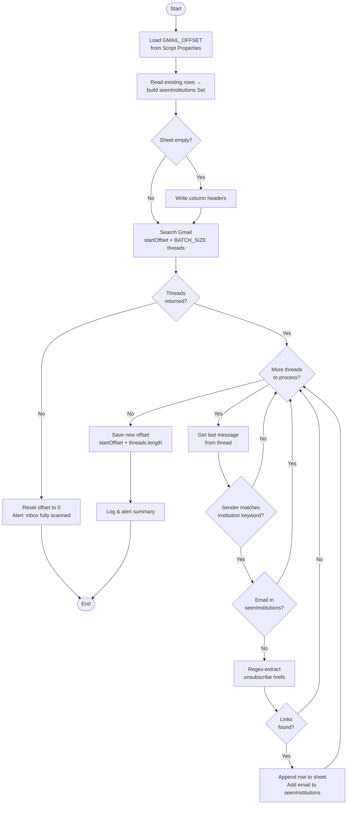

# Gmail Unsubscribe Link Finder

> A Google Apps Script that scans Gmail for institutional marketing emails and extracts unsubscribe links into a Google Sheet.


---

## Table of Contents

- [Overview](#overview)
- [Features](#features)
- [Configuration](#configuration)
- [Functions](#functions)
  - [findUnsubscribeLinks()](#findunsubscribelinks)
  - [resetBookmark()](#resetbookmark)
- [Sheet Output](#sheet-output)
- [Bookmark System](#bookmark-system)
- [Deduplication Logic](#deduplication-logic)
- [Permissions](#permissions)
- [Setup & Usage](#setup--usage)
- [Known Limitations](#known-limitations)

---

## Overview

This script searches a Gmail account for emails containing the word `"unsubscribe"`, filters them to retain only messages from educational institutions, extracts unsubscribe links from those emails, and writes the results to a Google Sheet.

A bookmark system allows the script to run in batches without re-processing the same emails across multiple executions.



---

## Features

| Feature | Description |
|---|---|
| 📦 Batch processing | Scans emails in configurable chunks to avoid Apps Script timeout limits |
| 🚫 Duplicate prevention | Tracks previously seen senders so each institution appears only once |
| 🏫 Institution filtering | Ignores non-educational senders using configurable keyword matching |
| 🔗 Link extraction | Uses regex to pull unsubscribe-style URLs from HTML email bodies |
| 🔖 Persistent bookmarks | Saves the scan position using Script Properties across executions |
| 📊 Sheet output | Appends results to a Google Sheet with auto-created headers |

---

## Configuration

All user-configurable values are grouped at the top of `findUnsubscribeLinks()` under the `// --- CONFIGURATION ---` comment block.

| Variable | Type | Default | Description |
|---|---|---|---|
| `SHEET_ID` | `String` | *(your Sheet ID)* | ID of the target Google Sheet. Found in the URL between `/d/` and `/edit`. |
| `SEARCH_QUERY` | `String` | `"unsubscribe"` | Gmail search query used to locate candidate emails. Supports any Gmail search syntax. |
| `BATCH_SIZE` | `Number` | `500` | Maximum threads to process per run. Reduce if hitting execution time limits. |
| `INSTITUTION_KEYWORDS` | `Array<String>` | See below | Substrings matched against the sender's From header to identify institutional emails. |
| `LINK_PATTERNS` | `Array<String>` | See below | URL path substrings used to identify unsubscribe-related links in email bodies. |

### `INSTITUTION_KEYWORDS`

A sender is considered institutional if **any** of these strings appear (case-insensitively) in the From header:

```
university · college · institute · academy · school · edu · alumni · admissions · registrar · department of
```

### `LINK_PATTERNS`

Any `href` in the email body matching **at least one** of these patterns is captured:

```
unsubscribe · optout · preferences · stop-mail · click-here · manage · remove
```

Multiple matches for a single sender are joined with newlines in one cell.

---

## Functions

### `findUnsubscribeLinks()`

Main entry point. Orchestrates the full scan-and-write pipeline. Returns `void` — results are written directly to the configured Google Sheet.

**Execution flow:**

1. **Load bookmark** — reads `GMAIL_OFFSET` from Script Properties (defaults to `0` on first run)
2. **Build duplicate set** — scans existing sheet rows and stores seen sender emails in a `Set`
3. **Initialize headers** — writes column headers if the sheet is empty
4. **Search Gmail** — calls `GmailApp.search(SEARCH_QUERY, startOffset, BATCH_SIZE)`
5. **Filter & extract** — checks institution keywords, skips duplicates, regex-extracts matching `href` values from the last message's HTML body
6. **Write results** — appends qualifying rows to the sheet
7. **Update bookmark** — saves `startOffset + threads.length` back to Script Properties

```js
// Core search call
const threads = GmailApp.search(SEARCH_QUERY, startOffset, BATCH_SIZE);

// Institution keyword check
const isInstitution = INSTITUTION_KEYWORDS.some(
  keyword => lowerFrom.includes(keyword)
);

// Link extraction regex
const regex = new RegExp(
  `href="([^"]*(?:${patternString})[^"]*)"`, 'gi'
);

// Bookmark update
const newOffset = startOffset + threads.length;
scriptProperties.setProperty('GMAIL_OFFSET', newOffset.toString());
```

**Edge cases:**

- If no threads are returned, the bookmark is reset to `0` and the function exits early
- If the sheet is completely empty, column headers are automatically written before any data rows
- Only the **last message** in each thread is inspected — earlier messages are ignored

---

### `resetBookmark()`

Helper function. Sets `GMAIL_OFFSET` back to `"0"`, causing the next call to `findUnsubscribeLinks()` to restart from the most recent email.

```js
function resetBookmark() {
  PropertiesService.getScriptProperties()
    .setProperty('GMAIL_OFFSET', '0');
  Logger.log('Bookmark reset to 0.');
}
```

> [!TIP]
> Run this before starting a fresh scan, or after modifying `INSTITUTION_KEYWORDS` or `LINK_PATTERNS` — otherwise the script will skip already-processed threads.

---

## Sheet Output

Results are appended to the active sheet of the Google Sheet identified by `SHEET_ID`. Each qualifying sender produces exactly one row.

| Column | Header | Content |
|---|---|---|
| A | Institution/Sender | Full From header, e.g. `Stanford Admissions <admissions@stanford.edu>` |
| B | Last Subject | Subject line of the last message in the thread |
| C | Unsubscribe Link | All matching `href` URLs, joined by newlines |
| D | Date | Date of the last message in the thread |

---

## Bookmark System

The script uses `PropertiesService.getScriptProperties()` to persist the scan position between executions — no external storage required.

| Property Key | Type | Behaviour |
|---|---|---|
| `GMAIL_OFFSET` | `String` (numeric) | Index of the first thread to fetch next run. Incremented by `threads.length` each run. Reset to `"0"` when exhausted, or manually via `resetBookmark()`. |

> [!NOTE]
> `GmailApp.search()` returns results ordered **most recent → oldest**, so offset `0` is the newest email. Each run advances the offset deeper into older mail.

---

## Deduplication Logic

At startup, the script reads all existing rows and extracts each sender's email address — the part inside angle brackets, or the full From value if no brackets are present. These are stored case-insensitively in a `Set` called `seenInstitutions`.

Before writing any new row, the extracted email is checked against the set. If present, the thread is skipped entirely.

```js
// Extract email from "Name <email@domain.com>" format
const emailMatch = from.match(/<([^>]+)>/);
const emailOnly = emailMatch
  ? emailMatch[1].toLowerCase()
  : lowerFrom;

// Skip if already processed
if (seenInstitutions.has(emailOnly)) return;
```

---

## Permissions

OAuth consent is requested on first run. The script requires the following Google Apps Script services:

| Service | Scope | Usage |
|---|---|---|
| `GmailApp` | Read Gmail | Searching threads, reading headers, body, and date |
| `SpreadsheetApp` | Read & write Sheets | Opening the sheet, reading existing rows, appending data |
| `PropertiesService` | Script Properties | Persisting `GMAIL_OFFSET` between executions |
| `Logger` | Internal | Writing progress messages to the Apps Script log |

---

## Setup & Usage

### Initial setup

1. Open the target Google Sheet and copy its ID from the URL — the string between `/d/` and `/edit`
2. Paste the ID into the `SHEET_ID` constant at the top of `findUnsubscribeLinks()`
3. Open Google Apps Script via **Extensions → Apps Script**, or go to [script.google.com](https://script.google.com)
4. Paste the script, save, and select `findUnsubscribeLinks` as the function to run
5. Click **Run** and grant the required OAuth permissions when prompted

### Running subsequent batches

Run `findUnsubscribeLinks()` again to process the next `BATCH_SIZE` threads. The script picks up where it left off. Repeat until the *"No more emails found"* alert appears.

### Starting a fresh scan

Call `resetBookmark()` from the editor, then run `findUnsubscribeLinks()` again. The script will restart from the most recent email.

> [!TIP]
> To automate batches, set a time-based trigger in Apps Script (**Triggers → Add Trigger**) to call `findUnsubscribeLinks` on a schedule until the inbox is fully scanned.

---

## Known Limitations

- **Last message only** — only the last message in each thread is scanned. If an earlier message contains the unsubscribe link but the most recent one does not, the link will be missed.
- **Keyword matching** — institution detection is substring-based. Senders whose name or domain contains none of the keywords are excluded regardless of their actual nature.
- **Broad link patterns** — patterns like `manage` or `click-here` may match URLs that aren't genuine unsubscribe links. Review the sheet output manually.
- **Rate limits** — `GmailApp.search()` has undocumented quota limits. Very large inboxes may require batches spread over time.
- **Cell readability** — all matched links for a sender are concatenated in one cell. Rows with many links may need manual height adjustment.

---

*Google Apps Script · V8 Runtime · Version 1.0*
